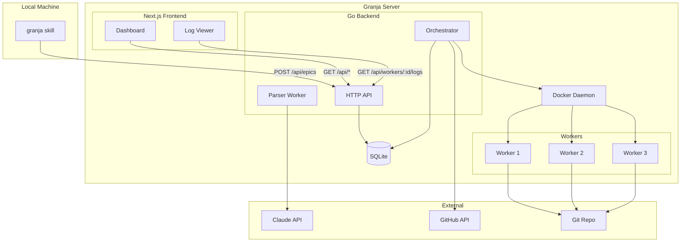
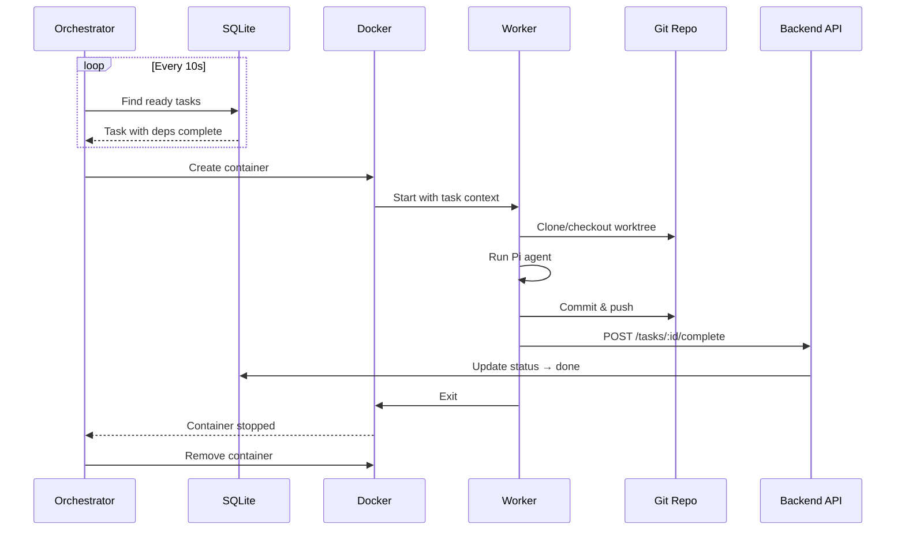
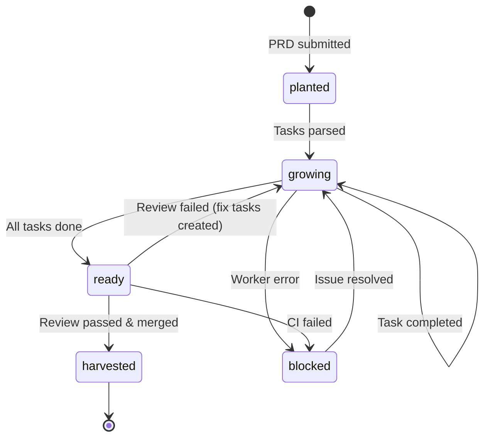
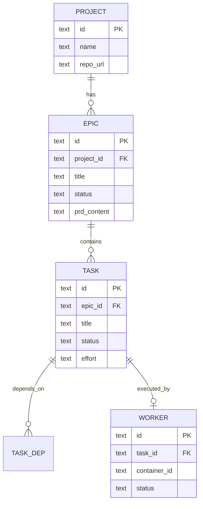

# Technical Design: Granja

## Executive Summary

Granja es un sistema de orquestación que automatiza el ciclo completo de desarrollo de software: recibir PRDs, generar tasks, ejecutar agentes en containers, hacer code review, y mergear a main.

**Approach:** Arquitectura de tres capas — Go backend (API + orchestrator), Next.js frontend (Kanban dashboard), y Docker para workers aislados. El orchestrator corre como goroutine que pollea por tasks listas y spawnea containers. SQLite como storage por simplicidad.

**Reusing:** Docker SDK para Go, Claude API para parsing de PRDs, Pi agent para ejecución de tasks.

**New:**
- Go backend con API REST + orchestrator daemon
- Next.js frontend con Kanban board y log viewer
- Worker Docker image con Pi preinstalado
- Local skill para publicar desde cualquier proyecto

**Scope:** Sistema completo con ~15 endpoints, 4 tablas SQLite, 1 Docker image, dashboard con 5 vistas. Complejidad media-alta por la coordinación de containers.

**Key decisions:**
1. Go para backend (mejor manejo de concurrencia y Docker SDK nativo)
2. SQLite en lugar de Postgres (single-user, simplifica deployment)
3. Polling en lugar de events (más simple, latencia de 10s aceptable)
4. Git worktrees para trabajo paralelo en mismo repo

---

## How It Works

### Publishing a PRD (Local → Server)

1. **El developer tiene un PRD listo** en `.features/my-feature/prd.md` y opcionalmente `design.md` en su proyecto local.

2. **Corre el skill** `granja publish --project hippo`. El skill lee ambos archivos, valida que el PRD tenga título y user stories.

3. **El skill hace POST** a `http://granja.local:3000/api/epics` con:
   ```json
   {
     "project": "hippo",
     "prd": "# PRD: Feature...",
     "design": "# Technical Design...",
     "repo_url": "git@github.com:user/hippo.git"
   }
   ```

4. **El API handler** (`EpicHandler.Create`) valida el payload, crea el epic en SQLite con status `planted`, y encola un job de parsing.

5. **El parser worker** (goroutine) detecta el nuevo epic, llama a Claude API con el PRD + Design, y recibe un JSON con tasks estructuradas:
   ```json
   {
     "tasks": [
       {"title": "Create Task model", "depends_on": [], "effort": "small"},
       {"title": "Add API endpoint", "depends_on": ["Create Task model"], "effort": "medium"}
     ]
   }
   ```

6. **El parser crea los tasks** en SQLite con dependencias, y mueve el epic a `growing`.

7. **El skill recibe** el epic ID y URL del dashboard. El developer puede ver el progreso en `http://granja.local:3000/epics/abc123`.

### Executing Tasks (Orchestrator → Docker → Pi)

1. **El orchestrator** (goroutine corriendo cada 10s) busca tasks con status `todo` cuyas dependencias estén todas en `done`.

2. **Encuentra Task #3** ("Add API endpoint") con todas las deps completas. Verifica que no exceda el límite de containers (default 3).

3. **Crea la branch del epic** si no existe: `git checkout -b epic/my-feature`. Usa worktrees para aislar el trabajo.

4. **Spawns Docker container** usando el SDK:
   ```go
   docker.ContainerCreate(ctx, &container.Config{
     Image: "granja-worker:latest",
     Env: []string{
       "TASK_ID=task-xyz",
       "REPO_URL=git@github.com:user/hippo.git",
       "BRANCH=epic/my-feature",
     },
     Cmd: []string{"/entrypoint.sh"},
   }, ...)
   ```

5. **Dentro del container**, el entrypoint:
   - Clona el repo (o usa cache)
   - Hace checkout del worktree
   - Construye el prompt con task description + context
   - Ejecuta `pi --print --dangerously-skip-permissions -p "$PROMPT"`

6. **Pi trabaja** en el task — lee archivos, hace cambios, corre tests.

7. **Al terminar**, el entrypoint:
   - Commitea los cambios: `git commit -m "feat(epic): Add API endpoint"`
   - Push a la branch
   - Notifica al orchestrator: `curl -X POST http://host:3000/api/tasks/{id}/complete`

8. **El orchestrator** marca el task como `done`, captura los logs del container, y lo termina.

9. **El siguiente poll** detecta que Task #4 ahora tiene deps completas, y el ciclo continúa.

### Reviewing and Merging

1. **Cuando todos los tasks de un epic están `done`**, el orchestrator mueve el epic a `ready`.

2. **Spawns un reviewer container** con contexto especial:
   - PRD completo
   - Diff de todos los cambios (`git diff main...epic/my-feature`)
   - Prompt: "Review this implementation against the PRD. For each user story, verify it's correctly implemented."

3. **El reviewer** (Pi en modo review) analiza y responde:
   ```json
   {
     "result": "PASS",
     "summary": "All 5 user stories correctly implemented. Tests pass.",
     "notes": ["Consider adding error handling for edge case X"]
   }
   ```
   o
   ```json
   {
     "result": "FAIL",
     "issues": [
       {"story": "US-003", "issue": "Missing pagination in list endpoint"},
       {"story": "US-005", "issue": "No validation on email field"}
     ]
   }
   ```

4. **Si PASS**, el orchestrator:
   - Crea PR via GitHub API
   - Si CI pasa (webhook o polling), auto-merge
   - Epic → `harvested`
   - Cleanup: borra worktree y branch

5. **Si FAIL**, el orchestrator:
   - Crea fix tasks para cada issue
   - Epic vuelve a `growing`
   - Cycle continues

### Viewing Progress (Dashboard)

1. **El developer abre** `http://granja.local:3000`.

2. **El frontend carga** `/api/epics?status=all` y renderiza el Kanban con 4 columnas:
   - **Planted** — PRDs recién subidos, parseando
   - **Growing** — Tasks en progreso
   - **Ready** — En review
   - **Harvested** — Mergeados

3. **Click en un epic** expande inline los tasks con sus estados.

4. **Click en un task `in_progress`** abre el log viewer con streaming de los logs del container.

5. **Polling cada 5s** actualiza los estados sin refresh manual.

---

## High-Level Architecture

### System Architecture



### Task Execution Flow



### Epic State Machine



---

## Data Model

### Schema

```sql
-- Projects: repos where work happens
CREATE TABLE projects (
    id TEXT PRIMARY KEY,
    name TEXT NOT NULL UNIQUE,
    repo_url TEXT NOT NULL,
    default_branch TEXT DEFAULT 'main',
    created_at DATETIME DEFAULT CURRENT_TIMESTAMP
);

-- Epics: units of work from PRDs
CREATE TABLE epics (
    id TEXT PRIMARY KEY,
    project_id TEXT NOT NULL REFERENCES projects(id),
    title TEXT NOT NULL,
    status TEXT NOT NULL DEFAULT 'planted',
    -- CHECK (status IN ('planted', 'growing', 'ready', 'harvested', 'blocked'))
    branch_name TEXT,
    prd_content TEXT NOT NULL,
    design_content TEXT,
    review_result TEXT, -- JSON: {result, summary, issues}
    error_message TEXT,
    created_at DATETIME DEFAULT CURRENT_TIMESTAMP,
    updated_at DATETIME DEFAULT CURRENT_TIMESTAMP
);

-- Tasks: individual work items
CREATE TABLE tasks (
    id TEXT PRIMARY KEY,
    epic_id TEXT NOT NULL REFERENCES epics(id),
    title TEXT NOT NULL,
    description TEXT,
    status TEXT NOT NULL DEFAULT 'todo',
    -- CHECK (status IN ('todo', 'in_progress', 'done', 'blocked'))
    effort TEXT, -- small, medium, large
    relevant_files TEXT, -- JSON array
    container_id TEXT,
    worker_logs TEXT,
    started_at DATETIME,
    completed_at DATETIME,
    created_at DATETIME DEFAULT CURRENT_TIMESTAMP
);

-- Task dependencies (DAG)
CREATE TABLE task_deps (
    task_id TEXT NOT NULL REFERENCES tasks(id),
    depends_on_id TEXT NOT NULL REFERENCES tasks(id),
    PRIMARY KEY (task_id, depends_on_id)
);

-- Active workers for monitoring
CREATE TABLE workers (
    id TEXT PRIMARY KEY,
    task_id TEXT NOT NULL REFERENCES tasks(id),
    container_id TEXT NOT NULL,
    status TEXT NOT NULL DEFAULT 'starting',
    -- CHECK (status IN ('starting', 'working', 'committing', 'done', 'error'))
    started_at DATETIME DEFAULT CURRENT_TIMESTAMP,
    last_heartbeat DATETIME
);
```

### Entity Relationships



---

## API Design

### Endpoints

| Method | Path | Request | Response | Purpose |
|--------|------|---------|----------|---------|
| POST | /api/projects | `{name, repo_url}` | `Project` | Create project |
| GET | /api/projects | - | `Project[]` | List projects |
| GET | /api/projects/:id | - | `Project` | Get project |
| POST | /api/epics | `{project_id, prd, design?}` | `Epic` | Create epic from PRD |
| GET | /api/epics | `?project=&status=` | `Epic[]` | List epics |
| GET | /api/epics/:id | - | `Epic` with tasks | Get epic details |
| DELETE | /api/epics/:id | - | - | Cancel/delete epic |
| GET | /api/tasks/:id | - | `Task` | Get task details |
| POST | /api/tasks/:id/complete | `{success, logs}` | `Task` | Worker reports completion |
| POST | /api/tasks/:id/fail | `{error, logs}` | `Task` | Worker reports failure |
| GET | /api/workers | - | `Worker[]` | List active workers |
| GET | /api/workers/:id/logs | - | SSE stream | Stream worker logs |
| POST | /api/config | `{max_workers, ...}` | `Config` | Update config |
| GET | /api/config | - | `Config` | Get config |
| GET | /api/health | - | `{status, workers}` | Health check |

### Request/Response Examples

**Create Epic:**
```json
// POST /api/epics
{
    "project_id": "proj_hippo",
    "prd": "# PRD: User Authentication\n\n## User Stories...",
    "design": "# Technical Design\n\n## Architecture..."
}

// Response 201
{
    "id": "epic_abc123",
    "project_id": "proj_hippo",
    "title": "User Authentication",
    "status": "planted",
    "branch_name": "epic/user-authentication",
    "created_at": "2026-03-20T21:00:00Z"
}
```

**Get Epic with Tasks:**
```json
// GET /api/epics/epic_abc123
{
    "id": "epic_abc123",
    "title": "User Authentication",
    "status": "growing",
    "tasks": [
        {"id": "task_1", "title": "Create User model", "status": "done"},
        {"id": "task_2", "title": "Add login endpoint", "status": "in_progress"},
        {"id": "task_3", "title": "Add JWT middleware", "status": "todo", "depends_on": ["task_2"]}
    ],
    "progress": {"done": 1, "in_progress": 1, "todo": 1, "total": 3}
}
```

---

## Backend Architecture

### Directory Structure

```
granja/
├── cmd/
│   └── server/
│       └── main.go          # Entry point
├── internal/
│   ├── api/
│   │   ├── handler/
│   │   │   ├── epic.go
│   │   │   ├── project.go
│   │   │   ├── task.go
│   │   │   └── worker.go
│   │   ├── middleware/
│   │   │   └── logging.go
│   │   └── router.go
│   ├── domain/
│   │   ├── epic.go           # Epic entity + business rules
│   │   ├── task.go
│   │   ├── project.go
│   │   └── worker.go
│   ├── service/
│   │   ├── epic_service.go
│   │   ├── task_service.go
│   │   ├── parser_service.go # Claude integration
│   │   └── docker_service.go # Container management
│   ├── repository/
│   │   ├── epic_repo.go
│   │   ├── task_repo.go
│   │   └── sqlite.go         # DB setup
│   └── orchestrator/
│       ├── orchestrator.go   # Main loop
│       ├── scheduler.go      # Task selection
│       └── reviewer.go       # Review logic
├── docker/
│   ├── worker/
│   │   ├── Dockerfile
│   │   └── entrypoint.sh
│   └── docker-compose.yml
├── web/                      # Next.js frontend
│   ├── app/
│   ├── components/
│   └── ...
└── go.mod
```

### Service Layer

**EpicService:**
- `Create(prd, design, projectID)` → creates epic, triggers parser
- `UpdateStatus(id, status)` → state transitions with validation
- `GetWithTasks(id)` → joins epic with tasks

**TaskService:**
- `MarkComplete(id, logs)` → updates status, checks if epic ready
- `MarkFailed(id, error, logs)` → handles worker failures
- `FindReady()` → finds tasks with all deps done

**DockerService:**
- `SpawnWorker(task)` → creates and starts container
- `StopWorker(containerID)` → stops and removes
- `StreamLogs(containerID)` → returns log channel
- `ListRunning()` → active containers

**ParserService:**
- `ParsePRD(prd, design)` → calls Claude, returns structured tasks
- Uses function calling for structured output

### Orchestrator

```go
type Orchestrator struct {
    taskService   *TaskService
    dockerService *DockerService
    config        *Config
}

func (o *Orchestrator) Run(ctx context.Context) {
    ticker := time.NewTicker(10 * time.Second)
    defer ticker.Stop()
    
    for {
        select {
        case <-ctx.Done():
            return
        case <-ticker.C:
            o.tick()
        }
    }
}

func (o *Orchestrator) tick() {
    // 1. Check for completed epics → trigger review
    // 2. Find ready tasks
    // 3. Spawn workers up to max limit
    // 4. Clean up finished containers
}
```

---

## Frontend Architecture

### Directory Structure (Next.js App Router)

```
web/
├── app/
│   ├── page.tsx              # Dashboard (Kanban)
│   ├── epics/
│   │   └── [id]/
│   │       └── page.tsx      # Epic detail
│   ├── projects/
│   │   └── page.tsx          # Project list
│   └── layout.tsx
├── components/
│   ├── kanban/
│   │   ├── Board.tsx
│   │   ├── Column.tsx
│   │   └── EpicCard.tsx
│   ├── epic/
│   │   ├── TaskList.tsx
│   │   ├── TaskCard.tsx
│   │   └── PRDViewer.tsx
│   ├── worker/
│   │   ├── WorkerList.tsx
│   │   └── LogViewer.tsx
│   └── ui/
│       ├── Badge.tsx
│       └── Modal.tsx
├── hooks/
│   ├── useEpics.ts
│   ├── useTasks.ts
│   └── useWorkerLogs.ts
└── lib/
    └── api.ts
```

### State Management

- **Server State:** React Query (TanStack Query) for API data
- **Client State:** Minimal — mostly derived from server state
- **Real-time:** Polling every 5s with React Query refetchInterval

### Key Components

**KanbanBoard:**
- 4 columns: planted, growing, ready, harvested
- Drag & drop disabled (status changes are automatic)
- Epic cards show progress bar

**EpicCard:**
- Title, project badge, progress (3/5 tasks)
- Click expands to show tasks inline
- Status badge with color coding

**LogViewer:**
- SSE connection to `/api/workers/:id/logs`
- Auto-scroll, ANSI color support
- Pause/resume streaming

---

## Docker Worker

### Dockerfile

```dockerfile
FROM ubuntu:22.04

# Install dependencies
RUN apt-get update && apt-get install -y \
    git \
    curl \
    ca-certificates \
    && rm -rf /var/lib/apt/lists/*

# Install Pi
RUN curl -fsSL https://get.pi.dev | bash

# Copy Pi config (mounted at runtime)
VOLUME /root/.pi

# Workspace for repo
WORKDIR /workspace
VOLUME /workspace

# Entrypoint script
COPY entrypoint.sh /entrypoint.sh
RUN chmod +x /entrypoint.sh

ENTRYPOINT ["/entrypoint.sh"]
```

### Entrypoint Script

```bash
#!/bin/bash
set -e

# Required env vars
: "${TASK_ID:?TASK_ID required}"
: "${REPO_URL:?REPO_URL required}"
: "${BRANCH:?BRANCH required}"
: "${GRANJA_API:?GRANJA_API required}"
: "${TASK_PROMPT:?TASK_PROMPT required}"

# Setup git
git config --global user.email "granja@localhost"
git config --global user.name "Granja Worker"

# Clone or update repo
if [ ! -d ".git" ]; then
    git clone "$REPO_URL" .
fi

# Create/checkout worktree branch
git fetch origin
git checkout -B "$BRANCH" origin/main || git checkout -B "$BRANCH"

# Run Pi agent
echo "Starting Pi for task: $TASK_ID"
if pi --print --dangerously-skip-permissions -p "$TASK_PROMPT"; then
    # Commit and push
    git add -A
    git commit -m "feat: $TASK_TITLE" || true
    git push -u origin "$BRANCH"
    
    # Report success
    curl -X POST "$GRANJA_API/api/tasks/$TASK_ID/complete" \
        -H "Content-Type: application/json" \
        -d '{"success": true}'
else
    # Report failure
    curl -X POST "$GRANJA_API/api/tasks/$TASK_ID/fail" \
        -H "Content-Type: application/json" \
        -d "{\"error\": \"Pi exited with non-zero\"}"
fi
```

---

## Local Skill

### Skill Structure

```
skills/granja/
├── SKILL.md
└── commands/
    └── publish.md
```

### Publish Command

**Trigger:** `granja publish --project <name>` or `/publish`

**Flow:**
1. Find `.features/{feature}/prd.md` in current directory
2. Optionally find `design.md`
3. Validate PRD has required sections
4. POST to Granja API
5. Return epic URL

---

## Implementation Plan per User Story

### US-001: Publish PRD and Design from local machine

**What changes:**
- Create `skills/granja/SKILL.md` — skill definition
- Create `skills/granja/commands/publish.md` — publish command

**How it works:**
- Skill reads PRD from `.features/{feature}/prd.md`
- Validates presence of title and user stories
- Makes POST request to Granja API
- Returns epic ID and dashboard URL

### US-002: Parse design into tasks

**What changes:**
- `internal/service/parser_service.go` — Claude integration
- `internal/orchestrator/parser_worker.go` — background worker

**How it works:**
- Parser worker polls for epics with status `planted`
- Calls Claude API with system prompt for structured task extraction
- Uses function calling to get JSON array of tasks
- Creates tasks in DB with dependencies
- Updates epic status to `growing`

### US-003: Display Kanban board

**What changes:**
- `web/app/page.tsx` — dashboard page
- `web/components/kanban/Board.tsx` — Kanban layout
- `web/components/kanban/Column.tsx` — column with epic cards
- `web/components/kanban/EpicCard.tsx` — epic card component
- `web/hooks/useEpics.ts` — data fetching hook

**How it works:**
- Dashboard fetches all epics grouped by status
- Renders 4 columns with drag-disabled cards
- Epic cards expandable to show tasks
- Polling every 5s for updates

### US-004: Spawn worker container for task

**What changes:**
- `internal/service/docker_service.go` — Docker SDK wrapper
- `internal/orchestrator/orchestrator.go` — main loop
- `internal/orchestrator/scheduler.go` — task selection
- `docker/worker/Dockerfile` — worker image
- `docker/worker/entrypoint.sh` — worker script

**How it works:**
- Orchestrator runs every 10s
- Finds tasks with status `todo` and all deps `done`
- Creates Docker container with task context
- Updates task status to `in_progress`
- Container runs Pi and reports back

### US-005: Execute task with Pi agent

**What changes:**
- `docker/worker/entrypoint.sh` — execution logic
- `internal/api/handler/task.go` — completion endpoint

**How it works:**
- Entrypoint clones repo, checks out branch
- Runs Pi with task prompt
- On success: commit, push, report complete
- On failure: report error with logs

### US-006: Parallelize independent epics

**What changes:**
- `internal/orchestrator/scheduler.go` — multi-epic scheduling
- `internal/config/config.go` — max workers setting

**How it works:**
- Scheduler finds ready tasks across all epics
- Spawns up to N workers (configurable)
- Uses worktrees to prevent conflicts
- Tasks within same epic run sequentially

### US-007: Review completed epic

**What changes:**
- `internal/orchestrator/reviewer.go` — review logic
- `internal/service/review_service.go` — review container

**How it works:**
- Orchestrator detects epic with all tasks `done`
- Spawns reviewer container with PRD + diff
- Pi reviews against requirements
- Returns PASS/FAIL with details

### US-008: Create fix tasks on failed review

**What changes:**
- `internal/orchestrator/reviewer.go` — fix task creation
- `internal/service/task_service.go` — create from issues

**How it works:**
- If review FAIL, parse issues from response
- Create task for each issue
- Set dependencies on completed tasks
- Epic returns to `growing`

### US-009: Merge to main on successful review

**What changes:**
- `internal/service/github_service.go` — GitHub API
- `internal/orchestrator/merger.go` — merge logic

**How it works:**
- Create PR via GitHub API
- Monitor CI status (webhook or polling)
- Auto-merge on green
- Update epic to `harvested`
- Cleanup branch and worktree

### US-010: View worker logs and status

**What changes:**
- `web/components/worker/LogViewer.tsx` — log component
- `internal/api/handler/worker.go` — log streaming
- `web/hooks/useWorkerLogs.ts` — SSE hook

**How it works:**
- LogViewer connects via SSE to `/api/workers/:id/logs`
- Backend streams Docker logs in real-time
- Supports ANSI colors, auto-scroll
- Logs persisted to task record on completion

---

## Trade-offs & Alternatives

### Decision: Go for backend

**Chosen:** Go with chi router and Docker SDK

**Alternative:** Node.js with Dockerode

**Why:** Go has better concurrency model for the orchestrator, native Docker SDK, and simpler deployment (single binary). The orchestrator needs to manage multiple containers and background workers — Go's goroutines are ideal.

### Decision: SQLite over Postgres

**Chosen:** SQLite with WAL mode

**Alternative:** PostgreSQL

**Why:** Single-user system, runs on one server. SQLite simplifies deployment (no separate DB process), backup (copy one file), and is plenty fast for this scale. Can migrate to Postgres later if needed.

### Decision: Polling over events

**Chosen:** 10s polling for orchestrator, 5s for dashboard

**Alternative:** Event-driven with Redis pub/sub or webhooks

**Why:** Polling is simpler to implement and debug. 10s latency is acceptable for a batch processing system. Can add events later for better responsiveness.

### Decision: Worktrees over separate clones

**Chosen:** Git worktrees for parallel work

**Alternative:** Full clone per worker

**Why:** Worktrees share the object store, saving disk space and clone time. Workers can work on different branches of same repo simultaneously without conflicts.

---

## Open Questions

- [ ] **Secret management** — How should workers access secrets (API keys, SSH keys)? Options: Docker secrets, env vars from config, mounted files.

- [ ] **Worker timeout** — What's a reasonable timeout for a task? 30 min default, configurable per project?

- [ ] **Retry policy** — Should failed tasks auto-retry? How many times? Exponential backoff?

- [ ] **Notifications** — Discord webhook? Email? Dashboard-only for MVP?

- [ ] **Multi-repo epics** — Can an epic span multiple repos? Probably not for MVP.
